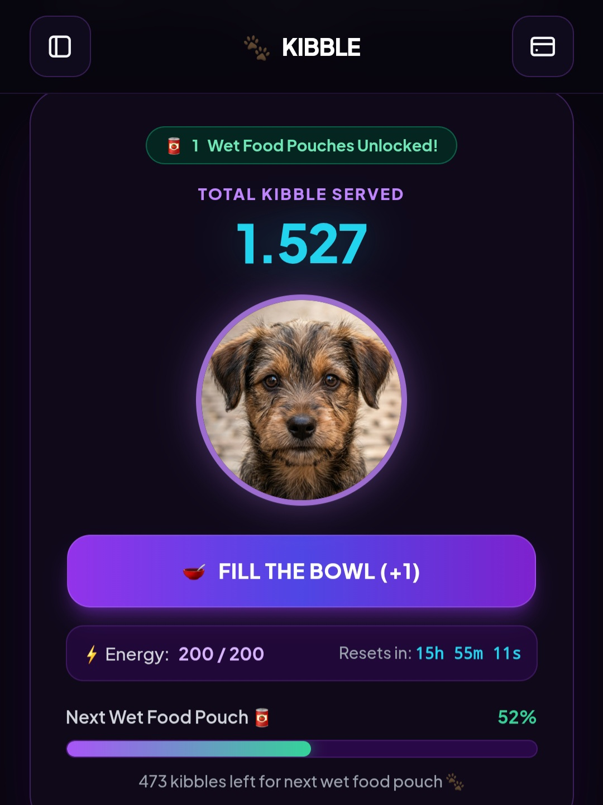
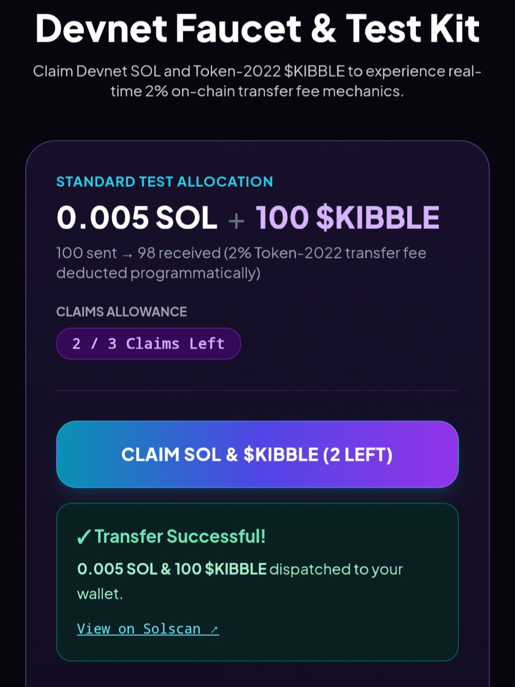
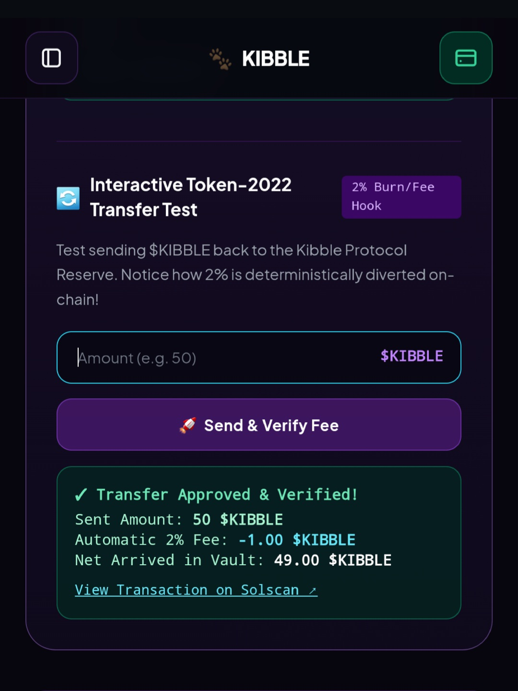
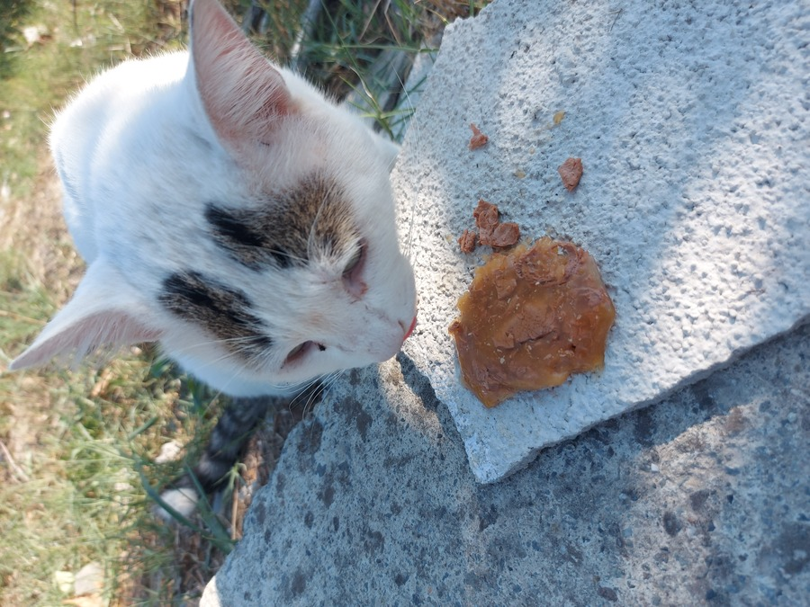

# 🐾 Kibble ($KIBBLE) - Impact-First Protocol on Solana

> **Not just a tap-to-feed game — an automated, on-chain animal welfare protocol powered by Solana.**

---

## 🌟 Overview

**Kibble** is an impact-first Web3 protocol built on Solana. Beyond the interactive front-end experience, Kibble establishes deep system-level architecture: converting on-chain trading volume and user engagement into protocol-driven funding via **Token-2022** transfer fees to buy and distribute physical food for stray animals.

- 🌐 **Live Web dApp:** [kibble-sol.github.io/Kibble/](https://kibble-sol.github.io/Kibble/)
- ✈️ **Telegram Hub:** [@kibblesol](https://t.me/kibblesol)
- 🐦 **X (Twitter):** [@kibblesol](https://x.com/kibblesol)

---

## ⚙️ Core Architecture & Mechanics

1. **Tap-to-Feed & Frontend Interface:** 
   Lightweight, highly engaging Web3 client interface that drives user acquisition and community interaction.

2. **Token-2022 Native Transfer Fee Extension:**
   Deep on-chain protocol mechanism that automatically collects revenue from token transactions, routing funds directly to the animal feeding treasury without manual friction.

3. **Autonomous Faucet & Vault Infrastructure:**
   Backend/API integrations and smart routing designed to manage test tokens, liquidity flows, and automated distribution loops.

4. **Proof of Feed (Real Impact):**
   Accumulated treasury funds are converted into physical kibble bags, distributed to street animals, and verified on-chain and via video documentation.

---

## 📱 Proof of Impact & Devnet Live Preview

| 🎮 Tap-to-Feed dApp | 🧪 Devnet Integration & Faucet |
| :---: | :---: |
|  |  |
| *Users engage via interactive frontend* | *Live Devnet testing & faucet workflow* |

| ⚙️ On-Chain Architecture Flow | 🐾 Real-World Feed |
| :---: | :---: |
|  |  |
| *Protocol execution & transaction monitoring* | *Proof of Feed: Real-world distribution* |

---

## 📂 Repository Structure

- `api/` - Faucet and backend routing scripts
- `assets/` - Brand identity, icons, and Devnet/proof media files
- `bot/` - Telegram automation engine & requirements
- `CONTRIBUTING.md` - Open-source contribution guidelines
- `LICENSE` - MIT License
- `README.md` - Project documentation
- `SECURITY.md` - Responsible disclosure policy
- `index.html` - Web dApp interface & Web3 client logic

---

## 🚀 Quickstart & Local Setup

Run the dApp locally in seconds without complex toolchains:

1. Clone the repository: `git clone https://github.com/kibble-sol/Kibble.git`
2. Navigate to the folder: `cd Kibble`
3. Open `index.html` directly in your browser.

---

## 🗺️ Roadmap #1

- [x] **01. Project Idea & Ideation**
  - Transforming trading volume into direct animal shelter relief via Solana Token-2022 architecture.

- [x] **02. Core Infrastructure Setup**
  - Web application buildout, Token-2022 transfer fee configuration, official Litepaper, and autonomous harvester logic.

- [x] **03. Public Devnet Testing**
  - Public Devnet deployment, faucet integration, and stress testing autonomous fee collection.

- [ ] **04. Mainnet Launch**⏳
  - 10M fixed supply deployment, 100% LP burn, revoked mint/freeze authorities, and live 2% fee routing.

- [ ] **05. First Verifiable Donation**
  - First automated Sunday loop execution: on-chain SOL transfer to partner shelter with full proof-of-feed documentation.

- [ ] **06. Full Community Governance**
  - Deployment of Quadratic Voting DAO portal, transferring protocol decisions and ecosystem reserve approvals directly to token holders.

---

## 🛠 Tech Stack

- **Blockchain:** Solana (Token-2022 Program with Transfer Fee Extension)
- **Frontend:** Vanilla HTML5 / CSS3 / JavaScript (Zero dependencies, fast load)
- **Backend & API:** Node.js / Serverless Faucet Logic
- **Database & State:** Firebase Realtime Database
- **Bot Engine:** Python (python-telegram-bot)
- **Deployment:** GitHub Pages

---

*Built with ❤️ for stray animals.*
